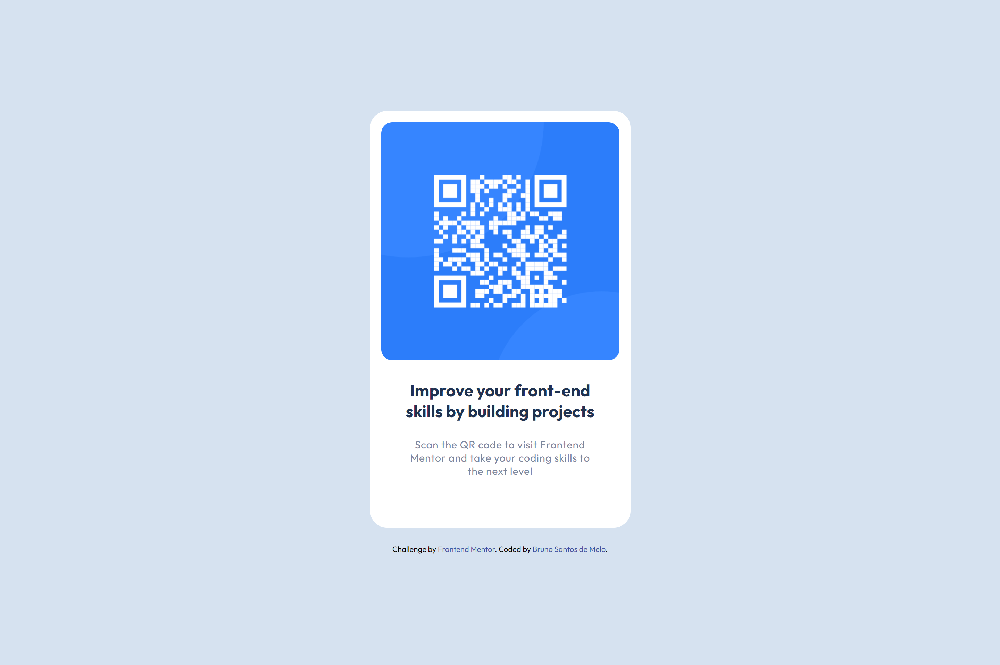

# Frontend Mentor - QR code component solution

This is a solution to the [QR code component challenge on Frontend Mentor](https://www.frontendmentor.io/challenges/qr-code-component-iux_sIO_H). Frontend Mentor challenges help you improve your coding skills by building realistic projects. 

## Table of contents

- [Overview](#overview)
  - [Screenshot](#screenshot)
  - [Links](#links)
- [My process](#my-process)
  - [Built with](#built-with)
  - [Continued development](#continued-development)
  - [Useful resources](#useful-resources)
- [Author](#author)

## Overview

Building a simple layout containing a qr code.

### Screenshot

### Links

- Solution URL: [Add solution URL here](https://github.com/BrnMelo)

## My process

As recommended I started this page development process in small steps until I was satisfied with the spacing of each component.

### Built with

- Flexbox
- Mobile-first workflow

### Continued development

I want to continue developing my skills using `flex-box`.

### Useful resources

- [:root](https://developer.mozilla.org/pt-BR/docs/Web/CSS/:root) - Helped me because it makes code optimization much easier, especially those that we have to repeat several times.

## Author

- GitHub - [Bruno Santos de Melo](https://github.com/BrnMelo)
- Frontend Mentor - [@BrnMelo](https://www.frontendmentor.io/profile/BrnMelo)
